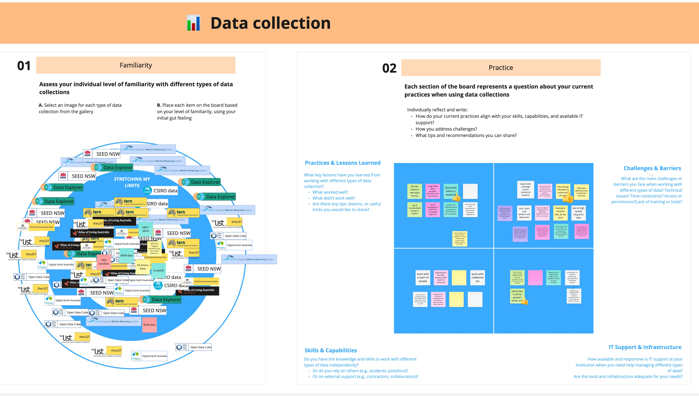
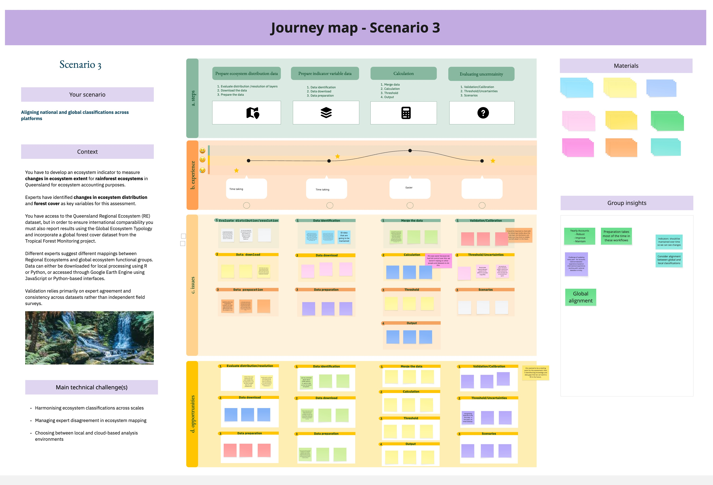

# Shaping the Workflow: Co-designing Ecosystem Indicators

## 1. Context

This workshop is designed as a co design exercise to gather structured feedback from a heterogeneous, multidisciplinary community of end users, including ecologists, data analysts, coders, and software engineers, on a demo workflow for ecosystem indicator development. This is the first of a series of co-design workshop for the [Ecosystem Indicators Workflows (EIW)](https://ardc.edu.au/project/ecosystem-indicator-workflows/) project to make sure the workflow are build in a way that reflects how people actually work, increasing their usability.

The workflow follows the FAIR principles (Findable, Accessible, Interoperable, Reusable) and supports key applications such as ecosystem risk assessment, ecosystem accounting, and the IUCN Green Status. Given the diversity of expertise, institutions, and working practices among users, the workshop aimed to understand how people interact with the workflow in practice, where friction occurs, and what types of support and collaboration mechanisms are needed to improve usability and adoption.

### Workshop aims

The primary aims of the workshop are to:

• Understand how users with different disciplinary backgrounds and skill levels interact with each stage of the workflow.

• Identify opportunities and barriers across the indicator development process.

• Clarify support needs, including documentation, training, troubleshooting, and peer support.

• Explore ways to strengthen collaboration and knowledge exchange within the user community.

• Generate concrete, user driven insights to improve the usability, clarity, inclusivity, and FAIRness of the workflow.

### Expected outcomes

The workshop is expected to deliver:

• A clear picture of user needs, pain points, and motivations across disciplines.

• Insights into which workflow stages are intuitive and which are challenging.

• A prioritised set of support mechanisms (e.g. documentation, training, peer exchange, troubleshooting).

• Ideas to enhance collaboration and knowledge sharing within the community.

• Practical, user informed recommendations to improve the usability, clarity, and FAIRness of the workflow.

The session had two exercises:

1.  Methods familiarity: To build a shared understanding of participants’ experience across key components of the workflow and identify strengths, gaps, and challenges in working with different data collections, programming languages, analytical tools, data formats, and platforms.

    

2.  Indicator scenarios: Using real-world scenarios that includes a defined ecosystem, purpose, and technical context (e.g., data, platforms, tools, and programming languages), participants have to discuss how they can solve the different steps in the workflow: what can they solve with their own skills, with the help from teammates, with help from (hypothetical) external collaborators, and what is unrealistic, and what kind of resources would be needed (time for training, funds for computing resources, etc).

    

## 2. Workflow

In this repository, we outline the steps and R code needed to evaluate patterns in comments and inputs provided by workshop participants. We focus on exploring user needs (e.g. documentation, training, peer exchange, and troubleshooting), identifying ideas to enhance collaboration and knowledge sharing within the community, and developing practical, user-informed recommendations to improve the usability, clarity, and FAIRness of workflows.

To achieve this, we combine graphical analysis with topic modelling techniques to visualise and interpret patterns in participants’ comments.

### 2.1 Requirements

This workflow requires:

-   [R](https://www.r-project.org/) [Free]
-   [RStudio](https://posit.co/download/rstudio-desktop/) [Free]

### 2.2 Setup

1.  Download [GitHub Desktop](https://github.com/apps/desktop) or any other Git manager to handle Git without the struggle.

2.  Clone this repository to a local folder using your chosen Git manager. Don't work in the main branch!! Create your branch and commint the changes and I'll review and incorporate any change in the code if needed.

3.  Install the required packages.

You're all set! :rocket: This repository is now ready for the standard workflow described below.

## 3. Folders

### `/scripts`

`step1_general_pattern.R` : This script is designed to analyse and visualize information collected from workshop participants to better understand who they are and how they engage with tools, data, and platforms. We: 1) characterise participants by summarising their profiles, including career stage, institutional affiliation, ecosystem focus (realm), and application areas; 2) Quantify and visualise participation patterns using percentage-based summaries and clear graphical outputs; 3) Assess familiarity levels with a range of tools, data sources, formats, platforms, and programming languages.

`step2_practiceLDA` : This script applies topic modelling techniques to analyse open-text responses from workshop participants, with the goal of uncovering patterns in current data practices, challenges, and capabilities.

### `/inputs`

Original data source from the Miro board with the answers and input provided by the participants.

### `/outputs`

Contains all analysis objects (plots and tables) generated by files in `/scripts`.

# A community of practice 🙂

*“Learning is the engine of practice, and practice is the history of that learning.”*

― Etienne Wenger
