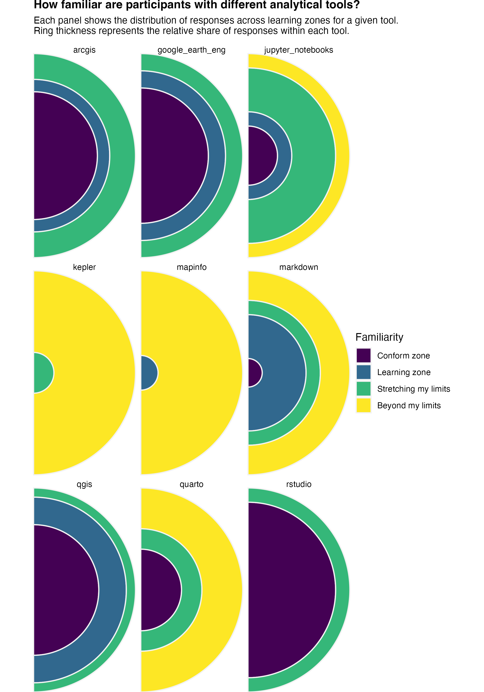

# Familiarity

### Analytical tools

Participants demonstrate strong familiarity with a small set of core tools, particularly RStudio, QGIS, and to a slightly lesser extent ArcGIS and Google Earth, where most responses fall within the comfort and learning zones. This indicates these tools are well established and can serve as the foundation of current workflows. In contrast, tools such as Markdown occupy an intermediate position, with responses concentrated in the learning and stretching zones, suggesting they are known but not yet fully integrated into everyday use. Finally, tools like Kepler, MapInfo, and Quarto exhibit very low familiarity, with most responses in the stretching or beyond limits zones, indicating limited adoption and potential barriers to use.

{fig-align="center" width="400"}

Efforts should prioritize:

-   Strengthening advanced capabilities in already familiar tools, including automation, performance, advanced spatial analysis, incentive best-practice, and peer sharing.

-   Providing targeted training and practical resources (e.g. practical use cases, templates, and examples) to move intermediate tools into the comfort zone.

-   Carefully evaluating whether low-familiarity tools should be supported through introductory training or replaced with more widely adopted alternatives to reduce complexity and improve overall efficiency.

### Data collections

Participants appear most comfortable with sources such as Environment-related datasets and “Other” (Research Data Australia, AODN, ebird, CLoud Optimised formats (Zarr, Parquet), SA Enviro Data, BOM Data, Q-spatial), where the majority of responses fall in the comfort zone, indicating strong familiarity and routine use.

In contrast, sources such as CSIRO Data Explorer, TERN, and other national infrastructures show a dominance of the learning zone, suggesting awareness but limited practical experience. Finally, platforms like SEED NSW, IMOS, The LIST, and some specialised portals are concentrated in the stretching and beyond limits zones, indicating that many participants either have minimal exposure or find them difficult to use.

{fig-align="center" width="400"}

For data collections with low familiarity (e.g., SEED NSW, IMOS, The LIST). before investing heavily in training, it is important to assess:

Whether these platforms are **critical** to organisational goals. Whether they **duplicate functionality** available in more familiar tool. If a tool is not essential, consider: **Streamlining the ecosystem** by prioritising fewer, widely adopted sources. Encouraging use of more familiar alternatives to reduce complexity

Participants rely heavily on a **core set of familiar data sources**, while many specialised platforms remain underutilised. The most effective strategy is not to train on everything, but to **prioritise key platforms, support gradual skill development where adoption is feasible, and simplify the overall data ecosystem where possible**.
